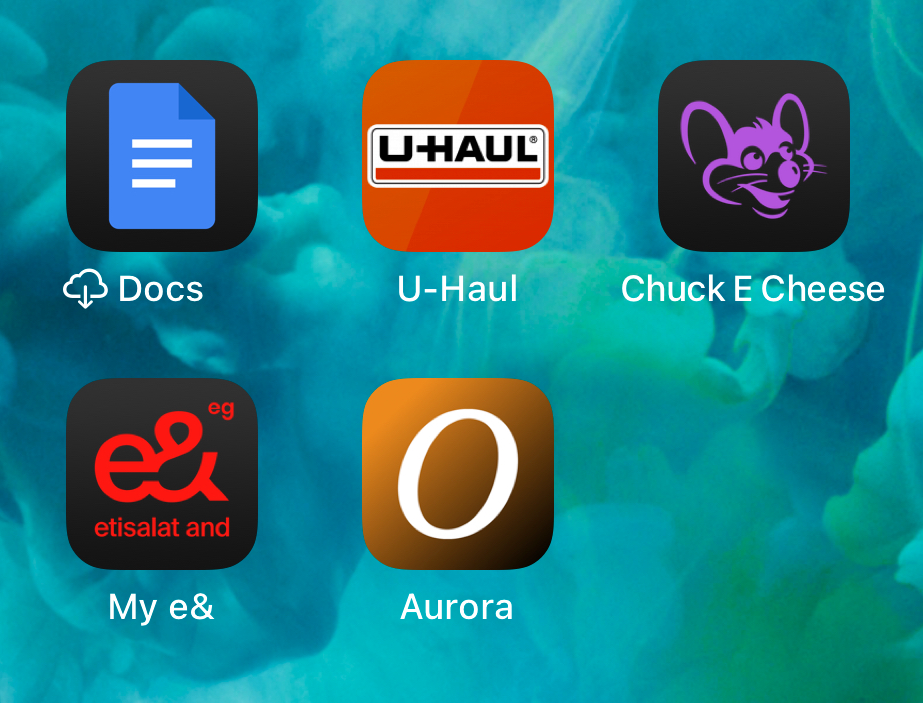

# Aurora Mobile Engineer Take-Home

This simple flutter application satisfies the requirements outlined in the take-home assignment for Aurora Mobile Engineer position.

## Features Implemented

- Fetch random images from Unsplash API
- Display images with proper loading and error states with caching in mind
- Change background color based on the dominant color of the image
- Toggle between light and dark modes
- clean architecture using with MVC pattern inspired by uncle bob!
- GetX for state management and dependency injection and routing
- Get Storage for local storage of theme mode preference
- Flutter Animate package for quick animation api usage
- Audioplayers package for sound effects
- Vibration package for haptic feedback

## Polish

- Smooth animations and transitions
- pressed state for light and dark modes
- Basic accessibility considerations like color contrast and button sizes

## Extra credit 🤞

I was inspired by the website intro, and even though it wasn’t part of the task, I saw it as a fun challenge to recreate the similar experience in a mobile app using Flutter. I’m excited to share it with you all, but just to be clear, this isn’t something I’d do in a regular day-to-day job. It was just a little playful experiment!

- Tried to replicate aurora's intro animation from https://joinaurora.co/
- logo build up animation on app start.
- font family change to `Hellix-Medium` so it can match the website more closely.
- typewriter effect for the welcome text.

  > I added a vibration effect for each character as it’s typed — it gives such a satisfying, tactile feel! You won’t get the full experience on a simulator or in a video, so it’s definitely worth trying on a real device. ( I tested on an iphone, but it should work on Android too! )

- shimmer effect on the (Apply) button.
- background color transition and footer fade in.
- added 3d and shimmer effect to the image card.

  > The first thing that popped into my head when I saw the logo animation was the classic PlayStation intro! 😄 I couldn’t resist adding a little sound to match it. Make sure to keep your volume up when you play the video or try the app — it’s part of the experience!

## How to run

1. Clone the repository
2. Run `flutter pub get` to install dependencies
3. Run `flutter run` to start the application on a connected device or simulator

## Media

#### App Demo Video

<a href="./demo/AURORA.mp4" target="_blank">Watch Demo Video </a>

---

#### IOS app icon

